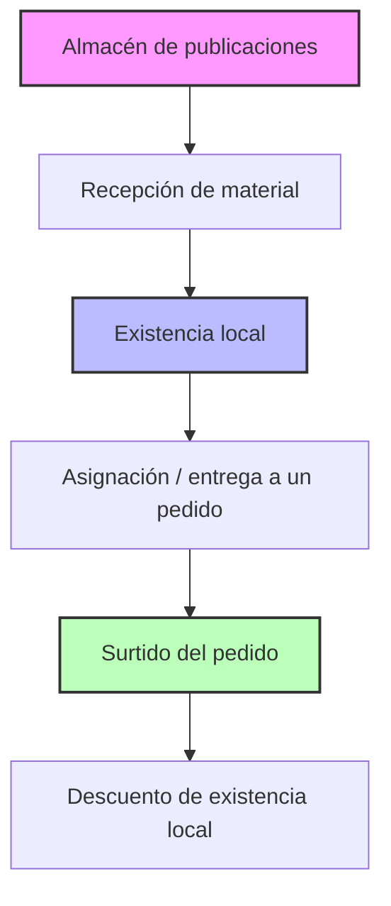

# Request Manager App


Una aplicación móvil diseñada para llevar el control interno de solicitudes de literatura y publicaciones.

---

## Versión actual

**0.1.6+8**

Estado actual:
- Base del proyecto y Design System completados.
- Modelo Publication implementado y probado.
- Persistencia SQLite v1 implementada.
- Tabla publications y constraints validados.
- Acceso local para registrar publicaciones completado.
- Acceso local para consultar publicaciones completado.
- Búsqueda local de publicaciones por nombre completada.
- Búsqueda local de publicaciones por código completada.
- Detección de duplicados por código y atributos (PublicationDuplicateChecker) completada.

---

## 1. Identificación del Proyecto

| Parámetro | Detalle |
| :--- | :--- |
| **Nombre del proyecto** | Request Manager App |
| **Nombre visible (App)** | Request Manager App |
| **Repositorio** | `request_manager_app` |
| **Proyecto Flutter** | `request_manager_app` |
| **Idioma de la aplicación** | Español |
| **Plataforma inicial** | Android |
| **Framework** | Flutter |
| **Lenguaje** | Dart |
| **Persistencia inicial** | SQLite |

---

## 2. Propósito de la Aplicación

**Request Manager App** es una herramienta para la gestión y control interno de inventario y pedidos de literatura (libros, revistas y otras publicaciones). 

> [!IMPORTANT]
> **No es una aplicación comercial.** No es una app de ventas ni de compras; por lo tanto, **no manejará precios, importes ni pagos** de ningún tipo.

Su propósito fundamental es registrar:
* **Solicitudes:** Qué publicaciones fueron solicitadas, quién realizó la solicitud, cuándo se realizó y qué cantidad se pidió.
* **Existencias:** Qué material ha llegado físicamente al almacén local y qué cantidad permanece disponible.
* **Entregas:** Qué cantidad ha sido utilizada para surtir cada pedido.
* **Estados:** Qué pedidos permanecen pendientes, parcialmente surtidos o completamente surtidos.

---

## 3. Concepto de Pedido

Un **pedido** agrupa una o más publicaciones solicitadas por un mismo solicitante en una fecha determinada.

### Datos de un Pedido
* **Solicitante:** Nombre o identificador de la persona.
* **Fecha del pedido:** Fecha en que se realiza la solicitud.
* **Detalle de publicaciones:** Cada artículo solicitado incluye:
  * Código (ej. `RL-12`)
  * Nombre
  * Tipo
  * Tamaño
  * Versión
  * Cantidad solicitada

### Regla de Agrupación
* Las publicaciones solicitadas conjuntamente en una misma fecha pueden pertenecer al mismo pedido.
* **Regla estricta:** Una solicitud realizada en una fecha posterior debe generar un **nuevo pedido**, incluso si proviene del mismo solicitante y existe un pedido anterior pendiente. Esto se debe a que cada solicitud inicia su propio periodo de espera y los materiales se reciben en momentos diferentes.

#### Ejemplo de Agrupación:

**Pedido #001**
* **Solicitante:** María
* **Fecha:** 17/08/2026
* **Artículos:**
  * 2 × Libro A
  * 5 × Revista B

Si María solicita otra publicación el 22/08/2026:

**Pedido #002**
* **Solicitante:** María
* **Fecha:** 22/08/2026
* **Artículos:**
  * 3 × Libro C

*Nota: No se debe agregar el "Libro C" al Pedido #001.*

---

## 4. Separación entre Recepción, Existencia y Surtido

> [!IMPORTANT]
> **La recepción física de una publicación y el surtido de un pedido son eventos independientes.**
> Toda publicación recibida ingresa primero a la **existencia local**. La llegada del material al almacén local **NO** marca automáticamente un pedido como surtido.

### Flujo General del Sistema



En formato de texto:
1. **Almacén de publicaciones** $\rightarrow$ **Recepción de material**
2. **Recepción de material** $\rightarrow$ **Existencia local**
3. **Existencia local** $\rightarrow$ **Asignación / entrega a un pedido**
4. **Asignación / entrega a un pedido** $\rightarrow$ **Surtido del pedido**
5. **Surtido del pedido** $\rightarrow$ **Descuento de existencia local**

---

## 5. Existencia Local

El sistema controla la cantidad físicamente disponible de cada publicación en tiempo real. 

### Ejemplo:
* **Existencia inicial** de `RL-12`: `0`
* **Recepción:** `+15` unidades de `RL-12`
* **Nueva Existencia local:** `15`

*En este punto, ningún pedido se considera surtido de forma automática.*

---

## 6. Surtido desde Existencia Local

Cuando se asigna material de la existencia local para atender un pedido, se debe registrar simultáneamente una salida de inventario y un incremento en la cantidad surtida del artículo en el pedido.

### Ejemplo de Surtido:
* **Pedido:** Solicitado `RL-12`: `10` | Surtido: `0`
* **Existencia local** `RL-12`: `15`

Si se entregan **6 unidades** al pedido:
* **Resultado del Pedido:**
  * Solicitado: `10`
  * Surtido: `6`
  * Pendiente: `4`
  * **Estado:** Parcialmente surtido
* **Resultado de Existencia local:** `15 - 6 = 9`

Si posteriormente se entregan las **4 unidades** restantes:
* **Resultado del Pedido:**
  * Solicitado: `10`
  * Surtido: `10`
  * Pendiente: `0`
  * **Estado:** Surtido
* **Resultado de Existencia local:** `9 - 4 = 5`

---

## 7. Surtidos Parciales

Un artículo en un pedido puede ser surtido en partes mediante múltiples entregas en fechas diferentes.

### Ejemplo de Entregas Múltiples:
* **Cantidad solicitada:** `20`
* **Entrega 1:** `5` unidades
* **Entrega 2:** `7` unidades
* **Entrega 3:** `8` unidades

Para asegurar la trazabilidad, **no se permite utilizar una única fecha de surtido** por pedido o artículo. Debe existir un historial detallado de entregas que registre:
* Cantidad entregada.
* Fecha de entrega.
* Pedido afectado.
* Artículo afectado.

---

## 8. Gestión de Estados

Los estados se calculan dinámicamente a partir de los movimientos de surtido registrados, evitando la modificación manual de estados.

### Estado por Artículo
Se determina según las cantidades solicitadas y surtidas:
* **Pendiente:** $\text{Surtido} = 0$
* **Parcialmente surtido:** $\text{Surtido} > 0$ y $\text{Surtido} < \text{Solicitado}$
* **Surtido:** $\text{Surtido} \ge \text{Solicitado}$

### Estado del Pedido Completo
Refleja la situación global de todos sus artículos:
* **Pendiente:** Ningún artículo del pedido ha sido surtido (ni total ni parcialmente).
* **Parcialmente surtido:** Existe al menos una entrega parcial en algún artículo, pero aún quedan unidades o artículos pendientes por surtir.
* **Surtido:** Todos los artículos y cantidades solicitadas en el pedido han sido completamente entregados ($\text{Pendiente} = 0$ para todos los artículos).

---

## 9. Trazabilidad de Inventario

El sistema no almacena únicamente un valor estático de "existencia actual". El diseño contempla un **historial de movimientos** que justifica y detalla el origen de dicho inventario.

### Tipos de Movimientos
1. **ENTRADA:** Recepción de publicaciones al almacén.
2. **SALIDA:** Material utilizado para surtir un pedido. *Debe mantener una referencia obligatoria al pedido y al artículo que originaron el movimiento.*

### Cálculo de Existencia
La existencia actual de cualquier publicación se calcula conceptualmente mediante la fórmula:
$$\text{Existencia} = \text{Total de Entradas} - \text{Total de Salidas}$$

---

## 10. Ejemplo Completo del Flujo

A continuación se presenta un escenario completo que ilustra cómo interactúan todos los componentes del sistema:

| Paso | Acción / Suceso | Estado del Pedido | Movimientos de Inventario | Existencia Local (`RL-12`) |
| :--- | :--- | :--- | :--- | :---: |
| **1** | María crea un pedido de 10 ejemplares de `RL-12`. | **Solicitado:** 10<br>**Surtido:** 0<br>**Pendiente:** 10<br>**Estado:** Pendiente | *Ninguno* | **0** |
| **2** | Llegan 15 ejemplares de `RL-12` al almacén. | **Solicitado:** 10<br>**Surtido:** 0<br>**Pendiente:** 10<br>**Estado:** Pendiente | **ENTRADA:** +15 | **15** |
| **3** | Se entregan 6 ejemplares a María desde la existencia local. | **Solicitado:** 10<br>**Surtido:** 6<br>**Pendiente:** 4<br>**Estado:** Parcialmente surtido | **SALIDA:** -6<br>(Destino: Pedido María) | **9** |
| **4** | Se entregan los 4 ejemplares restantes a María. | **Solicitado:** 10<br>**Surtido:** 10<br>**Pendiente:** 0<br>**Estado:** Surtido | **SALIDA:** -4<br>(Destino: Pedido María) | **5** |

---

## 11. Principios Iniciales de Negocio

El diseño y desarrollo de la aplicación se rigen por los siguientes principios fundamentales:

1. Un pedido puede contener múltiples publicaciones.
2. Solicitudes realizadas posteriormente generan pedidos nuevos.
3. Los artículos de un pedido pueden surtirse parcialmente.
4. Diferentes artículos del mismo pedido pueden surtirse en fechas distintas.
5. Un mismo artículo puede surtirse mediante múltiples entregas.
6. Toda publicación recibida entra primero a existencia local.
7. Recibir material no significa que un pedido haya sido surtido.
8. El surtido ocurre cuando material de existencia local es asignado o entregado a un pedido.
9. Surtir un pedido disminuye la existencia local.
10. La existencia local debe conservar trazabilidad mediante movimientos.
11. La aplicación **no** manejará precios ni pagos.
12. La interfaz de usuario estará completamente en **español**.

---

## 12. Alcance Actual y Decisiones Pendientes

> [!WARNING]
> Este documento representa una **especificación inicial en evolución**. Los siguientes aspectos técnicos y funcionales no están definidos aún y se resolverán en etapas posteriores del desarrollo:

* 📐 **Diseño de Base de Datos:** Modelo relacional completo y esquemas de tablas SQLite.
* 🏗️ **Arquitectura de Software:** Patrón de arquitectura final de la aplicación.
* 📦 **Librerías Flutter:** Dependencias específicas adicionales a SQLite.
* 🔄 **Manejo de Estado:** Gestor de estado a implementar (Bloc, Provider, Riverpod, etc.).
* 🔐 **Seguridad y Usuarios:** Sistema de autenticación, roles y control de acceso.
* ☁️ **Sincronización:** Mecanismos de respaldo, sincronización remota o base de datos en la nube.
* ⚙️ **Backend:** Integración con servidores externos o APIs.
* 📊 **Reportes:** Generación de estadísticas y visualización de datos de rendimiento.
* 🔔 **Notificaciones:** Sistema de alertas internas o notificaciones push.

---

## 13. Sistema de Diseño Visual

Se ha implementado una identidad visual consistente siguiendo la directiva **Moderno y Limpio — Propuesta 1** enfocada en legibilidad y visualización administrativa limpia en teléfonos Android modernos.

### 🎨 Paleta de Colores Definitiva

El sistema utiliza colores hexadecimales centralizados para asegurar un entorno profesional libre de elementos decorativos excesivos:

* **Azul Oscuro / Navy (`#0F2C59`):** Encabezados, títulos principales y barras de navegación.
* **Azul Brillante (`#1A73E8`):** Botones principales, enlaces y estados de foco activos.
* **Blanco (`#FFFFFF`):** Fondo de tarjetas, campos y superficies principales.
* **Gris Claro (`#F8F9FA`):** Fondo general de la aplicación.
* **Gris Medio (`#6B7280`):** Textos secundarios y leyendas.
* **Verde Esmeralda (`#10B981`):** Estados completados (Surtido completo).
* **Naranja Amber (`#F59E0B`):** Estados parciales (Surtido parcial).
* **Azul Suave (`#3B82F6`):** Estados pendientes o informativos.
* **Rojo Carmesí (`#EF4444`):** Errores, alertas o acciones destructivas.

### 📁 Organización del Código

El sistema de diseño visual está completamente desacoplado de las futuras funcionalidades de negocio y se ubica en el núcleo (`core`):

```text
lib/
  core/
    theme/
      app_colors.dart       # Paleta de colores centralizada
      app_spacing.dart      # Tokens de márgenes, padding y espacios (xs, sm, md, lg, xl)
      app_typography.dart   # Estilos tipográficos (titulos, body, badges, destacados)
      app_theme.dart        # Configuración central de ThemeData (Material 3)

    widgets/
      app_card.dart         # Tarjetas blancas con bordes redondeados y contorno sutil
      app_status_badge.dart # Badges/chips en español para estados (Pendiente, Surtido, etc.)
      app_buttons.dart      # Botones unificados (Primary, Secondary, Destructive)
      app_fields.dart       # Campos de formulario (TextFormField, DateField, Dropdown)
      app_states.dart       # Vistas de estado centralizadas (Loading, Empty, Error)
```

### ⚠️ Regla Obligatoria para Futuras Vistas

> [!IMPORTANT]
> Toda nueva pantalla o componente de **Request Manager App** debe utilizar el sistema de diseño centralizado. 
> Antes de crear colores, estilos, botones, tarjetas, badges o componentes nuevos, comprobar si ya existe un equivalente reutilizable en `lib/core/`.
> 
> Si una futura pantalla necesita una variante visual nueva, se debe **extender el sistema de diseño** en `core` en lugar de implementar la variante únicamente dentro de esa pantalla.

---

## 14. Modelo de Dominio de Publicaciones

El modelo de dominio `Publication` representa una publicación o elemento de literatura (libro, revista, folleto, etc.) en el catálogo central de la aplicación. Sirve como fuente de datos centralizada para pedidos, recepciones e inventarios.

### 📐 Campos del Modelo

* **`id` (`int?`):** Identificador interno único. Puede ser `null` antes de persistirse en la base de datos local SQLite.
* **`code` (`String?`):** Código de catálogo de la publicación (ej. `RL-12`, `W26-1`). Puede ser `null` durante un `DRAFT` y es obligatorio para una publicación `COMPLETE`.
* **`name` (`String`):** Nombre descriptivo de la publicación. Obligatorio (no se aceptan cadenas vacías o con puros espacios).
* **`description` (`String?`):** Información complementaria o descripción operativa para búsqueda en borradores rápidos.
* **`type` (`String?`):** Tipo de publicación (Libro, Revista, Folleto, etc.). Puede ser `null` en un `DRAFT` y obligatorio para `COMPLETE`.
* **`size` (`TriStateValue<String>`):** Representación del tamaño/formato físico.
* **`version` (`TriStateValue<String>`):** Variante o edición de la publicación.
* **`isActive` (`bool`):** Permite desactivar/activar publicaciones del catálogo sin borrarlas físicamente. Por defecto es `true`.
* **`createdAt` (`DateTime`):** Fecha de creación del registro.
* **`updatedAt` (`DateTime`):** Fecha de la última modificación del registro.

### 🔄 Representación de Tamaño y Versión (`TriStateValue`)

Para evitar la ambigüedad de usar únicamente `null`, las propiedades `size` y `version` se encapsulan en el tipo `TriStateValue<String>`, que soporta exactamente tres estados semánticos:
1. **`SIN DEFINIR` (`TriState.sinDefinir`):** Aún no se conoce el dato y debe investigarse.
2. **`NO APLICA` (`TriState.noAplica`):** El atributo no corresponde a este tipo de publicación.
3. **`CON VALOR` (`TriState.conValor`):** Contiene una cadena de texto específica no vacía.

### ⚡ Estados de Completitud (`DRAFT` / `COMPLETE`)

El estado de una publicación se calcula dinámicamente según la presencia de sus campos esenciales:
* **`COMPLETE`:** Cuando se cuenta con `code`, `name` y `type` válidos (no nulos ni vacíos).
* **`DRAFT`:** Si falta cualquiera de los tres campos esenciales anteriores.

Exponiéndose a través de la propiedad calculada `status`.

### 🚀 Flujo de Evolución de la Entidad y Registro Rápido

* **Evolución Inmutable:** La transición de un borrador (`DRAFT`) a una publicación completa (`COMPLETE`) se realiza mediante inmutabilidad y el método `copyWith`, conservando exactamente el mismo identificador de registro (`id`) para mantener la integridad en pedidos históricos y stock.
* **Registro Rápido en Pedidos (`quickDraft`):** Permite crear borradores rápidos sobre la marcha con solo suministrar un `name` y una `description` operativos. La descripción es obligatoria en este contexto para facilitar la localización posterior de la publicación real en catálogos externos.

---

## 15. Persistencia SQLite Inicial

Se ha implementado la infraestructura inicial de base de datos relacional local basada en **SQLite** utilizando el paquete `sqflite` y `path`.

### ⚙️ Configuración y Estructura
* **Base de datos:** `request_manager.db`
* **Versión inicial:** `1`
* **Localización del código:**
  * `lib/core/database/app_database.dart`: Singleton que expone la conexión, administra el ciclo de vida y facilita hooks aislados para testing.
  * `lib/core/database/database_constants.dart`: Constantes centralizadas para la base de datos (nombre de tablas, columnas y valores de estado).
  * `lib/core/database/migrations/migration_v1.dart`: Definición del esquema inicial (versión 1) con soporte para futuras migraciones.

### 📊 Tabla `publications`
La persistencia de publicaciones se modela mapeando el estado de tamaño (`size`) y versión (`version`) a dos columnas cada uno (`state` y `value`). El estado `status` (`DRAFT` / `COMPLETE`) de una publicación es conceptual y calculado dinámicamente en memoria, por lo que **no** se almacena una columna independiente.

#### Esquema de Restricciones (Constraints)
Para proteger la integridad de los datos a nivel de base de datos, se aplican las siguientes reglas:
* **Nombre obligatorio:** `CHECK (TRIM(name) <> '')`
* **Código opcional pero único:** Permite múltiples borradores (`DRAFT`) sin código (`code = NULL`), pero si se suministra un código, éste debe ser único de manera **case-insensitive** mediante un índice parcial:
  ```sql
  CREATE UNIQUE INDEX idx_publications_code_unique
  ON publications(code COLLATE NOCASE)
  WHERE code IS NOT NULL AND TRIM(code) <> '';
  ```
* **Coherencia del tamaño (`size`) y versión (`version`):**
  * Los estados de tamaño y versión están restringidos a `undefined`, `value` o `not_applicable`.
  * Si el estado es `value`, el valor no puede ser nulo ni vacío.
  * Si el estado es `undefined` o `not_applicable`, el valor asociado debe ser estrictamente `NULL`.
* **Estado activo/inactivo (`is_active`):** Almacenado como entero (`0` para inactivo, `1` para activo) bajo la restricción `CHECK (is_active IN (0, 1))`.
* **Fechas:** Almacenadas en formato de texto ISO-8601, lo cual permite realizar conversiones y filtros temporales de manera nativa en Dart (`DateTime.parse`).

### 📐 Capa de Persistencia, Registro y Consultas

Para el registro y la consulta de publicaciones se implementó la arquitectura estructurada en base a la separación de responsabilidades:

```text
Publication (Dominio)
       ↓
PublicationRepository (Dominio Interfaz)
       ↓
PublicationRepositoryImpl (Datos)
       ↓
PublicationLocalDataSource (Datos SQLite)
       ↓
PublicationMapper (Datos Mapeo)
       ↓
AppDatabase (Conexión SQLite)
```

* **`PublicationRepository` / `PublicationRepositoryImpl`**: Abstracción del repositorio que ofrece soporte para:
  * `Future<Publication> create(Publication publication)`: Valida que el ID sea nulo antes de registrar la publicación.
  * `Future<List<Publication>> getAll()`: Retorna todas las publicaciones en orden alfabético (`name ASC` case-insensitive).
  * `Future<Publication?> getById(int id)`: Recupera una publicación por su ID, validando que el ID sea mayor a 0 (lanza `ArgumentError` en caso contrario).
  * `Future<List<Publication>> searchByName(String query, {int limit = 20})`: Busca publicaciones activas cuyo nombre coincida de forma parcial y case-insensitive con el query provisto.
  * `Future<List<Publication>> searchByCode(String query, {int limit = 20})`: Busca publicaciones activas cuyo código coincida de forma parcial y case-insensitive con el query provisto.
* **`PublicationLocalDataSource`**: Gestiona las consultas y escrituras directas sobre SQLite, abstrayendo excepciones de base de datos (`DatabaseException` / `Database closed`) a excepciones de dominio limpias (`PublicationPersistenceException` o `DuplicatePublicationCodeException`).
* **`PublicationMapper`**: Mapeador bidireccional que convierte cada fila de SQLite (`Map<String, Object?>`) en una entidad de dominio completa (`Publication`) y viceversa.
* **Reglas de Búsqueda por Nombre (`searchByName`)**:
  * **Normalización**: Se realiza `trim()` al query. Si queda vacío, se devuelve inmediatamente `[]` sin realizar peticiones a la base de datos.
  * **Límite**: Por defecto limitado a 20 resultados. Si `limit <= 0`, lanza `ArgumentError`.
  * **Solo Activos**: Solo se incluyen registros donde `is_active = 1`.
  * **Estados**: Devuelve tanto publicaciones `DRAFT` como `COMPLETE`.
  * **Priorización de Relevancia**: Ordena los resultados según el nivel de coincidencia:
    1. Coincidencia exacta (`name = query`)
    2. Empieza con (`name LIKE query%`)
    3. Contiene (`name LIKE %query%`)
    *Para un mismo nivel de relevancia, se ordena alfabéticamente (`name COLLATE NOCASE ASC`) y de forma final por su ID (`id ASC`).*
  * **Escaping de Caracteres Especiales**: Los caracteres comodín de SQL (`%`, `_`) y el carácter de escape (`\`) se escapan de forma segura utilizando la cláusula `ESCAPE '\'` para buscar sus valores literales correspondientes en el nombre.
  * **Limitación actual respecto a acentos**: La búsqueda utiliza `COLLATE NOCASE` y `LIKE` de SQLite, por lo que es case-insensitive pero **accent-sensitive** (sensible a acentos y diacríticos, ej. `edicion` no coincide con `edición` automáticamente). Se documenta como mejora a futuro.
* **Reglas de Búsqueda por Código (`searchByCode`)**:
  * **Normalización**: Se realiza `trim()` al query. Si queda vacío (o contiene puros espacios), se devuelve inmediatamente `[]` sin realizar peticiones a la base de datos.
  * **Límite**: Por defecto limitado a 20 resultados. Si `limit <= 0`, lanza `ArgumentError`.
  * **Solo Activos**: Solo se incluyen registros donde `is_active = 1`.
  * **Estados**: Devuelve tanto publicaciones `DRAFT` (si tienen código asignado) como `COMPLETE`. Un borrador sin código simplemente queda excluido de la búsqueda.
  * **Priorización de Relevancia**: Ordena los resultados según el nivel de coincidencia:
    1. Coincidencia exacta (`code = query` case-insensitive)
    2. Empieza con (`code LIKE query%`)
    3. Contiene (`code LIKE %query%`)
    *Para un mismo nivel de relevancia, se ordena lexicográficamente (`code COLLATE NOCASE ASC`) y de forma final por su ID (`id ASC`). El ordenamiento natural no está soportado en esta versión.*
  * **Escaping de Caracteres Especiales**: Los caracteres comodín de SQL (`%`, `_`) y el carácter de escape (`\`) se escapan utilizando la cláusula `ESCAPE '\'`.

---

## 16. Sistema de Detección de Duplicados

Se ha implementado una capa especializada de validación mediante `PublicationDuplicateChecker` para prevenir el registro accidental de publicaciones redundantes o con códigos en conflicto.

### ⚡ Estrategia de Niveles y Severidad

La validación distingue dos categorías principales de duplicados:

```text
Duplicate detection
├── Duplicate code (active & inactive) → hard block
├── Attribute match (active only) → warning
└── No match → continue
```

1. **Código Duplicado (`DUPLICATE_CODE` / Bloqueo Duro)**:
   - Los códigos son únicos entre todas las publicaciones, incluidas las publicaciones inactivas.
   - Si la publicación candidata define un código (`code`), se busca mediante `findByExactCode` si ya existe un registro (activo o inactivo) con el mismo código exacto (case-insensitive).
   - En caso afirmativo, se genera un estado de bloqueo definitivo. La interfaz de usuario no debe permitir continuar.
   - **Garantía SQLite**: Si la capa superior intentara evadir la comprobación en memoria, el índice único `idx_publications_code_unique` de SQLite actuará como última línea de defensa, lanzando `DuplicatePublicationCodeException`.

2. **Posible Duplicado por Atributos (`POSSIBLE_DUPLICATE` / Advertencia)**:
   - La detección de posibles duplicados por atributos solo considera publicaciones activas (`is_active = 1`).
   - Si no existe conflicto por código, se buscan publicaciones activas que tengan datos similares utilizando la combinación principal:
     $$\text{name} + \text{type} + \text{size} + \text{version}$$
   - Si se detectan coincidencias compatibles, se retorna el estado de advertencia con la lista de publicaciones encontradas. La interfaz de usuario podrá mostrar estos candidatos y permitir al usuario cancelar o continuar explícitamente.

3. **Sin Duplicados (`NONE` / Permitir Continuar)**:
   - No se detecta conflicto de código ni coincidencia por atributos. Se permite el registro de forma normal.

### 📐 Reglas de Compatibilidad de Atributos

La comparación es determinista y no utiliza algoritmos de similitud difusa (fuzzy matching) ni semántica:
* **`name`**: Participa siempre. Se normaliza aplicando `trim()` y comparación case-insensitive.
* **`type`**: Si está definido en ambos registros, se compara aplicando `trim()` y case-insensitive. Si está sin definir (`null`) en alguno, se asume compatible (información incompleta, no se asume diferencia).
* **`size` y `version` (`TriStateValue`)**:
  - `undefined` (sinDefinir): Representa información faltante ("no sabemos"). Se considera compatible con cualquier valor (`not_applicable` o `conValor`).
  - `not_applicable` (noAplica): Es un valor explícito. Solo es compatible con otro `not_applicable`.
  - `conValor`: Se considera compatible con otro `conValor` únicamente si los textos coinciden tras aplicar `trim()` y comparación case-insensitive.
* **Descripción**: El campo `description` **no** participa en la detección automática de duplicados para evitar falsos negativos, pero sí se incluye en la entidad de las coincidencias retornadas para que la UI se la muestre al usuario.
* **Drafts (Borradores)**: Participan plenamente en la detección. Al no tener código (`code = null`), omiten el paso de bloqueo duro y pasan a la validación por atributos para evitar duplicar borradores idénticos de forma accidental.

---

## Catálogo de Publicaciones (Fase 1 — Vista de Consulta)

Se ha implementado la pantalla del catálogo de publicaciones (`Publicaciones`) para consulta rápida de material activo en el sistema.

### 📚 Características Principales

1. **Búsqueda Escalada y Combinada**:
   - `searchByCode` + `searchByName` con prioridad de código en los primeros resultados.
   - Deduplicación automática de resultados por `Publication.id`.
   - Límite máximo fijado en 20 publicaciones.
   - Debounce de 300 ms y control de `requestRequestId` para prevenir race conditions.
2. **Vista de Detalle en Modo Lectura**:
   - Acceso mediante toque en cualquier ítem (`PublicationDetailPage`).
   - Mapeo de atributos `TriStateValue` ("Sin definir", "No aplica", valor real).
   - Indicación explícita para publicaciones sin código (`-Sin código-`).
   - Exclusivamente de consulta, sin acciones de edición o eliminación.
3. **Estados Visuales**:
   - Badges de estado `COMPLETE` (verde) y `DRAFT` (amarillo).
   - `AppLoadingIndicator` durante cargas asíncronas.
   - `AppEmptyState` diferenciado para catálogo vacío vs. búsqueda sin resultados.
   - `AppErrorState` con acción de reintento en caso de fallo en persistencia.

---

# Roadmap del proyecto

El roadmap debe reflejar el alcance actualmente definido y funcionar como documento vivo de avance.

## Reglas generales del roadmap

* Usar checklist Markdown con `- [ ]` para tareas pendientes.
* Cambiar a `- [x]` únicamente cuando una tarea haya sido realmente completada y validada.
* No marcar tareas como completadas solo porque hayan sido iniciadas.
* Cada fase debe tener un objetivo claro.
* Mantener las fases en orden lógico de implementación.
* No eliminar funcionalidades ya definidas.
* Si durante el desarrollo aparecen nuevas necesidades, agregar o reorganizar tareas sin perder el historial del alcance.
* Si una funcionalidad cambia, actualizar el roadmap y la documentación asociada.
* El roadmap debe servir tanto para conocer el alcance proyectado como el avance real del proyecto.
* Evitar agregar funcionalidades no acordadas.

---

# Roadmap inicial

## Fase 0 — Base del proyecto y documentación

### Estado: COMPLETADA

### Objetivo

Establecer la estructura técnica, documentación inicial y sistema visual que utilizará toda la aplicación.

### Tareas

* [x] Crear o validar el proyecto Flutter `request_manager_app`.
* [x] Configurar Android como plataforma inicial.
* [x] Confirmar que la aplicación compile y ejecute correctamente.
* [x] Mantener el `README.md` como documento principal del proyecto.
* [x] Documentar propósito y reglas generales de negocio.
* [x] Documentar el flujo Pedido → Recepción → Existencia local → Surtido.
* [x] Implementar el sistema visual base seleccionado: **Moderno y Limpio — Propuesta 1**.
* [x] Centralizar `ThemeData`, colores, tipografía y espaciados.
* [x] Crear los componentes visuales reutilizables necesarios.
* [x] Establecer que las nuevas vistas utilicen el sistema de diseño común.
* [x] Ejecutar `flutter analyze` sin errores relevantes.

---

## Fase 1 — Catálogo de publicaciones

### Estado: EN PROGRESO

### Objetivo

Crear una fuente única de publicaciones que pueda reutilizarse en pedidos, inventario y recepciones.

### Modelo inicial

Cada publicación podrá contener:

* Código.
* Nombre.
* Tipo.
* Tamaño.
* Versión.
* Estado activo/inactivo si posteriormente resulta necesario.

### Tareas

* [x] Diseñar el modelo `Publication`.
* [x] Crear la tabla SQLite correspondiente.
* [x] Crear acceso local para registrar publicaciones.
* [x] Crear acceso local para consultar publicaciones.
* [x] Permitir búsqueda por nombre.
* [x] Permitir búsqueda por código.
* [x] Evitar duplicados evidentes.
* [x] Crear una vista básica del catálogo si resulta necesaria.
* [ ] Validar persistencia después de reiniciar la aplicación.

---

## Fase 2 — Registro de pedidos

### Estado: PENDIENTE

### Objetivo

Permitir crear un pedido para un solicitante y agregar múltiples publicaciones dentro de la misma solicitud.

### Reglas

Un pedido:

* Pertenece a un solicitante.
* Tiene una fecha de creación/pedido.
* Puede contener múltiples publicaciones.
* No contiene precios.
* Agrupa publicaciones solicitadas en la misma fecha.
* Una solicitud realizada posteriormente debe generar un nuevo pedido.

### Tareas

* [ ] Diseñar el modelo `Request`.
* [ ] Diseñar el modelo `RequestItem`.
* [ ] Crear las tablas SQLite necesarias.
* [ ] Crear la vista **Nuevo pedido**.
* [ ] Permitir capturar solicitante.
* [ ] Permitir capturar la fecha del pedido.
* [ ] Permitir agregar múltiples artículos.
* [ ] Capturar cantidad solicitada por artículo.
* [ ] Permitir eliminar un artículo antes de guardar el pedido.
* [ ] Validar que el pedido contenga al menos un artículo.
* [ ] Guardar pedido y artículos de manera consistente.
* [ ] Evitar guardar pedidos parcialmente persistidos en caso de error.

---

## Fase 3 — Autocompletado de publicaciones

### Estado: PENDIENTE

### Objetivo

Agilizar la captura de pedidos reutilizando publicaciones previamente registradas.

### Comportamiento esperado

Al escribir parte del nombre o código de una publicación deben mostrarse coincidencias.

Ejemplo:

```text
Usuario escribe:
fol

Sugerencias:
Folleto
Folleto informativo
Folleto tamaño carta
```

También debe ser posible buscar por código:

```text
rl

RL-12 — Folleto
RL-18 — Revista
```

### Tareas

* [ ] Implementar búsqueda incremental.
* [ ] Mostrar sugerencias mientras el usuario escribe.
* [ ] Buscar por nombre.
* [ ] Buscar por código.
* [ ] Seleccionar una publicación existente.
* [ ] Autocompletar código, nombre, tipo, tamaño y versión.
* [ ] Mantener la cantidad solicitada como dato propio del pedido.
* [ ] Permitir registrar una nueva publicación cuando no existan coincidencias.
* [ ] Incorporar la nueva publicación al catálogo.
* [ ] Hacer que quede disponible para futuros pedidos.

---

## Fase 4 — Consulta y detalle de pedidos

### Estado: PENDIENTE

### Objetivo

Permitir consultar los pedidos creados y visualizar claramente su información.

### Tareas

* [ ] Crear vista de lista de pedidos.
* [ ] Mostrar número o identificador del pedido.
* [ ] Mostrar solicitante.
* [ ] Mostrar fecha.
* [ ] Mostrar estado.
* [ ] Permitir abrir el detalle.
* [ ] Mostrar todas las publicaciones del pedido.
* [ ] Mostrar cantidad solicitada por publicación.
* [ ] Preparar visualmente cantidad surtida y pendiente.
* [ ] Implementar estados visuales reutilizando `StatusBadge`.
* [ ] Manejar estados vacío, loading y error.

---

## Fase 5 — Recepción de publicaciones

### Estado: PENDIENTE

### Objetivo

Registrar la llegada física de publicaciones al departamento.

### Regla fundamental

Toda publicación recibida entra primero a **existencia local**.

Una recepción NO debe marcar automáticamente un pedido como surtido.

### Flujo

```text
Recepción
   ↓
Existencia local aumenta
```

### Tareas

* [ ] Crear el modelo de movimientos de inventario.
* [ ] Definir el tipo de movimiento `RECEIPT`.
* [ ] Crear tabla SQLite de movimientos.
* [ ] Crear la vista **Registrar recepción**.
* [ ] Buscar/seleccionar publicación desde el catálogo.
* [ ] Registrar cantidad recibida.
* [ ] Registrar fecha de recepción.
* [ ] Generar movimiento positivo de inventario.
* [ ] Validar que la existencia local aumente correctamente.
* [ ] Conservar historial de recepciones.

---

## Fase 6 — Existencia local

### Estado: PENDIENTE

### Objetivo

Mostrar y controlar las cantidades físicamente disponibles de cada publicación.

### Regla

La existencia local debe poder explicarse mediante movimientos.

Conceptualmente:

```text
Existencia =
Entradas
-
Salidas
```

### Tareas

* [ ] Crear vista de inventario local.
* [ ] Mostrar código y nombre de publicación.
* [ ] Mostrar cantidad disponible.
* [ ] Permitir búsqueda.
* [ ] Calcular correctamente la existencia.
* [ ] Mostrar publicaciones sin existencia cuando sea útil.
* [ ] Crear vista de historial de movimientos.
* [ ] Distinguir entradas y salidas.
* [ ] Mantener trazabilidad.

---

## Fase 7 — Surtido de pedidos desde existencia local

### Estado: PENDIENTE

### Objetivo

Permitir utilizar material físicamente disponible para atender total o parcialmente un pedido.

### Regla fundamental

Un pedido solo se considera surtido cuando unidades de existencia local son asignadas o entregadas al pedido.

El surtido:

```text
Pedido recibe unidades
        +
Existencia local disminuye
```

### Tareas

* [ ] Definir el tipo de movimiento `FULFILLMENT`.
* [ ] Permitir seleccionar un artículo pendiente de un pedido.
* [ ] Mostrar cantidad solicitada.
* [ ] Mostrar cantidad ya surtida.
* [ ] Mostrar cantidad pendiente.
* [ ] Mostrar existencia local disponible.
* [ ] Permitir capturar cantidad a surtir.
* [ ] Impedir surtir más unidades de las disponibles.
* [ ] Impedir surtir más unidades de las pendientes salvo regla futura explícita.
* [ ] Registrar la fecha del surtido.
* [ ] Generar una salida de inventario.
* [ ] Asociar la salida al pedido y al artículo.
* [ ] Actualizar automáticamente cantidades surtidas.
* [ ] Mantener historial de surtidos.

---

## Fase 8 — Surtidos parciales y estados automáticos

### Estado: PENDIENTE

### Objetivo

Controlar correctamente pedidos que se atienden en diferentes momentos.

### Estados por artículo

```text
Surtido = 0
→ Pendiente

Surtido > 0 y Surtido < Solicitado
→ Parcialmente surtido

Surtido >= Solicitado
→ Surtido
```

### Estados del pedido

* Pendiente.
* Parcialmente surtido.
* Surtido.

### Tareas

* [ ] Calcular estado de cada artículo.
* [ ] Calcular estado general del pedido.
* [ ] Evitar depender de estados manuales cuando puedan derivarse de datos.
* [ ] Mostrar estados mediante badges.
* [ ] Mostrar cantidad solicitada.
* [ ] Mostrar cantidad surtida.
* [ ] Mostrar cantidad pendiente.
* [ ] Conservar múltiples eventos de surtido.
* [ ] Mostrar historial cronológico.

---

## Fase 9 — Dashboard e indicadores

### Estado: PENDIENTE

### Objetivo

Crear una pantalla inicial que permita conocer rápidamente la situación general.

### Indicadores propuestos

* Pedidos pendientes.
* Pedidos parcialmente surtidos.
* Pedidos surtidos.
* Pedidos recientes.

### Tareas

* [ ] Crear pantalla Inicio.
* [ ] Mostrar resumen de pedidos.
* [ ] Mostrar pedidos recientes.
* [ ] Permitir acceso rápido a Nuevo pedido.
* [ ] Permitir acceso rápido a Recepciones.
* [ ] Permitir acceso rápido a Inventario.
* [ ] Mantener el estilo visual definido en la Propuesta 1.

---

## Fase 10 — Validaciones, estabilidad y experiencia de usuario

### Estado: PENDIENTE

### Objetivo

Fortalecer el comportamiento de la aplicación antes de considerar una primera versión estable.

### Tareas

* [ ] Validar formularios.
* [ ] Manejar errores de SQLite.
* [ ] Manejar operaciones asíncronas con estados de loading.
* [ ] Evitar duplicidad accidental de registros.
* [ ] Revisar operaciones transaccionales.
* [ ] Validar integridad entre pedidos, artículos y movimientos.
* [ ] Revisar comportamiento con base de datos vacía.
* [ ] Revisar comportamiento con grandes cantidades de registros.
* [ ] Revisar navegación.
* [ ] Revisar overflows.
* [ ] Revisar diferentes tamaños de pantalla.
* [ ] Ejecutar `flutter analyze`.
* [ ] Ejecutar pruebas funcionales principales.

---

# Funcionalidades fuera del alcance inicial

## Posibles mejoras futuras

No implementar todavía salvo que posteriormente sean aprobadas.

Considerar como posibles extensiones:

* Gestión formal de solicitantes.
* Filtros avanzados.
* Estadísticas.
* Reportes.
* Exportación de información.
* Respaldo y restauración.
* Sincronización remota.
* API/backend.
* Uso multiusuario.
* Autenticación.
* Notificaciones.
* Historial de cambios.
* Ajustes manuales de inventario.
* Cancelación de pedidos.
* Corrección de movimientos.
* Soporte para iOS.
* Versión web.

---

# Convención para actualizar el roadmap

Cada vez que se complete una funcionalidad:

1. Validar que funcione.
2. Ejecutar las verificaciones técnicas correspondientes.
3. Cambiar únicamente las tareas realmente completadas de:

```text
- [ ]
```

a:

```text
- [x]
```

4. Si una fase completa todos sus puntos, agregar claramente:

```text
Estado: COMPLETADA
```

5. Si una fase está en ejecución:

```text
Estado: EN PROGRESO
```

6. Si todavía no inicia:

```text
Estado: PENDIENTE
```

7. Si surge un nuevo requerimiento, determinar primero:

   * Si pertenece a una fase existente.
   * Si debe agregarse como nueva tarea.
   * Si modifica una regla funcional.
   * Si requiere crear una nueva fase.

8. Actualizar también la documentación funcional si el nuevo requerimiento modifica el comportamiento del sistema.

---

## 16. Versionamiento y Trazabilidad

A partir del hito actual, el proyecto sigue un control estricto de versiones y lanzamientos para garantizar la trazabilidad de cada incremento técnico y funcional.

### 📐 Estrategia de Versionamiento (App Version)
La versión de la aplicación en `pubspec.yaml` se rige bajo la estructura:
```text
MAJOR.MINOR.PATCH+BUILD
```

Durante el desarrollo previo a la primera versión estable, se usará la forma `0.MINOR.PATCH+BUILD`:
* **MAJOR (0):** Indica que el proyecto sigue en desarrollo activo y no ha alcanzado estabilidad de producción. La versión `1.0.0` se reservará para la primera entrega estable completa.
* **MINOR:** Se incrementa al implementar una capacidad funcional completa y significativa del roadmap (por ejemplo, `0.1.x` para catálogo, `0.2.x` para pedidos).
* **PATCH:** Se incrementa para lanzamientos de incrementos parciales o mejoras técnicas dentro de una misma capacidad funcional (por ejemplo, `0.1.0` dominio, `0.1.1` esquema SQLite, `0.1.2` persistencia local).
* **BUILD (después del `+`):** Es un entero estrictamente creciente (e.g. `+1`, `+2`, `+3`) que funciona como número de compilación global. **Nunca se reinicia**, incluso cuando se incrementan los valores de MINOR o PATCH.

#### Historial de versiones y evolución:
* `0.0.1+1`: Proyecto inicial y Design System.
* `0.1.0+2`: Modelo de dominio Publication.
* `0.1.1+3` (Versión actual): Persistencia SQLite inicial (tabla `publications` y restricciones).
* `0.1.2+4` (Próxima versión): Implementación de acceso local para registro de publicaciones.

> [!NOTE]
> **Diferencia entre versión de la app y versión de SQLite:**
> Son conceptos y números totalmente desacoplados. La versión de la aplicación (ej. `0.1.1+3`) refleja lanzamientos y cambios funcionales o de UI. La versión de la base de datos SQLite (ej. versión `1`) sólo aumenta si el esquema de tablas requiere una nueva migración física. Por ejemplo, en el futuro es posible tener la versión de aplicación `0.4.2+14` corriendo sobre el esquema de base de datos SQLite versión `3`.

### 📦 Nombres de APK Distribuibles
Para facilitar la identificación de los binarios distribuidos para pruebas o staging en Android, se utilizará la siguiente nomenclatura (reemplazando el caracter `+` por un guion):
```text
request_manager_app-v<VERSION>-build<BUILD>.apk
```
* Ejemplo actual: `request_manager_app-v0.1.1-build3.apk`
* Ejemplo futuro: `request_manager_app-v0.1.2-build4.apk`

### 🤝 Convención de Commits (Git)
Se utiliza una convención ligera de **Conventional Commits** para mantener el historial del repositorio legible y atómico:
* **`feat`**: Nueva funcionalidad (ej. `feat(publications): add local publication insert`).
* **`fix`**: Corrección de un bug (ej. `fix(database): fix code constraint check`).
* **`refactor`**: Reorganización de código sin cambiar comportamiento (ej. `refactor(theme): simplify card styling`).
* **`test`**: Creación o modificación de pruebas (ej. `test(database): validate size constraint`).
* **`docs`**: Cambios en documentación (ej. `docs: add changelog`).
* **`chore`**: Tareas de mantenimiento, dependencias o releases (ej. `chore(release): bump version to 0.1.1+3`).

Un commit no equivale necesariamente a una nueva versión. Es preferible hacer commits pequeños y atómicos que describan un cambio único, y realizar un commit de release (`chore(release)`) cuando el incremento completo haya sido finalizado y verificado mediante todas las pruebas.

### 🏷️ Git Tags para Releases
Las releases de producción o hitos importantes se etiquetarán en Git utilizando la versión funcional (sin incluir el build):
```text
v<MAJOR>.<MINOR>.<PATCH> (ej. v0.1.1)
```

---

# Estado inicial

Al crear esta sección del README, todas las tareas deben permanecer inicialmente sin marcar:

```text
- [ ]
```

No asumir que algo está implementado simplemente porque ya fue definido o documentado.

La definición funcional y la implementación son estados diferentes.


